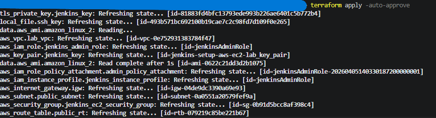
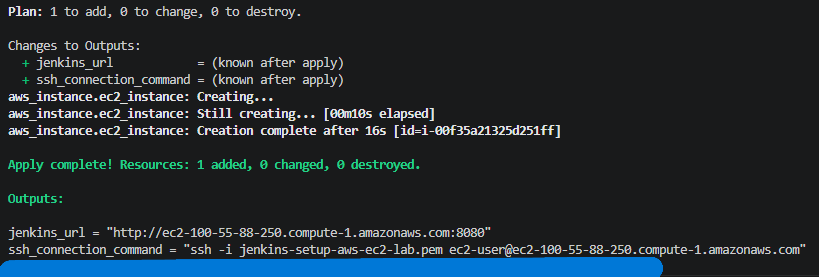
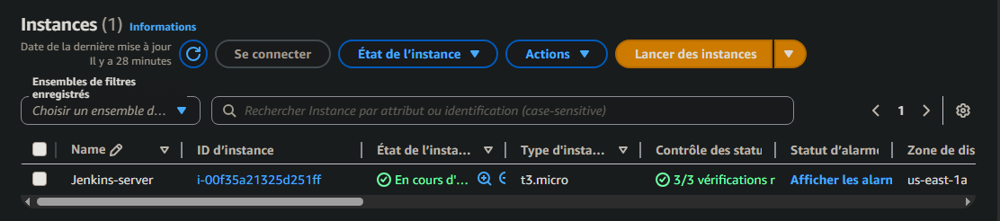
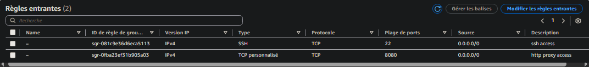
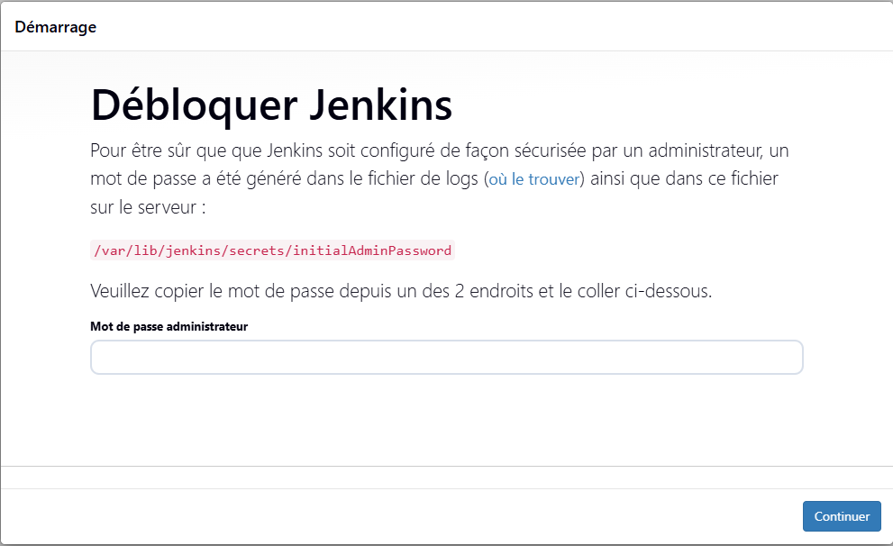
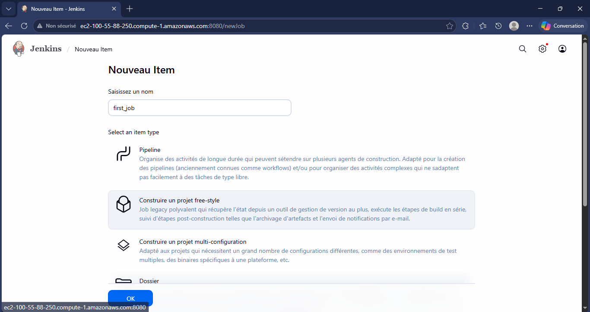
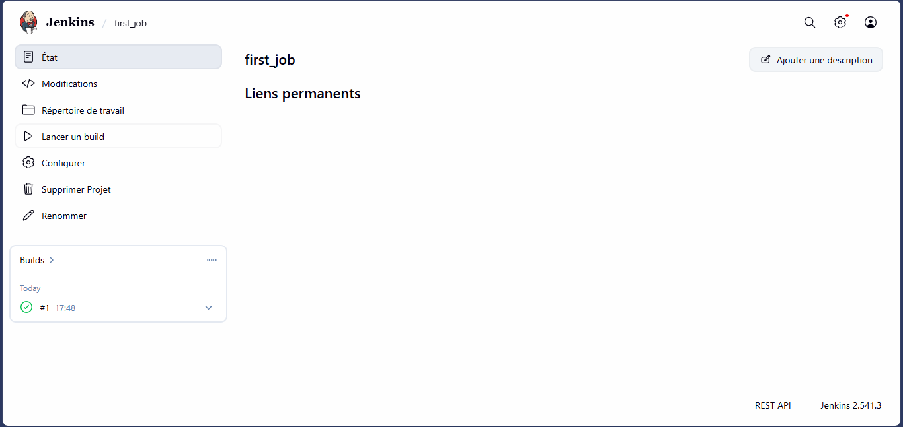
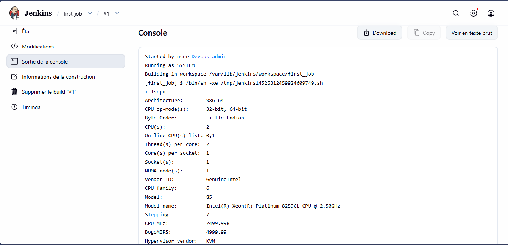
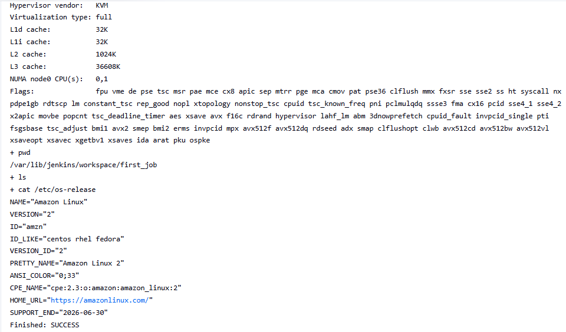

# Jenkins Deployment on AWS EC2 using Terraform

## Project Overview
This project demonstrates how to deploy and configure a Jenkins server on an AWS EC2 instance using Terraform. The goal is to automate the provisioning of infrastructure (Infrastructure as Code) and set up a functional Jenkins environment capable of running jobs.

## Technologies Used
- AWS EC2
- Terraform
- Jenkins
- Amazon Linux 2
- Bash Scripting

## Infrastructure Description
The infrastructure is fully automated using Terraform and includes :
A custom VPC
- A public subnet
- An Internet Gateway
- A route table for internet access
- A Security Group allowing :
   - SSH access (port 22)
   - Jenkins access (port 8080)
- An EC2 instance running Amazon Linux 2
- Automatic installation of Jenkins via a Bash script

## Deployment Process
The infrastructure is provisioned using Terraform :
```bash
terraform init
terraform plan
terraform apply -auto-approve
```
Once deployed, Terraform outputs the public URL of the Jenkins server.

## Jenkins Configuration
After deployment:
- Access Jenkins via the public IP on port 8080
- Connect to the EC2 instance using SSH
- Retrieve the initial admin password : sudo cat /var/lib/jenkins/secrets/initialAdminPassword
- Complete Jenkins setup :
   - Install suggested plugins
   - Create admin user

## Jenkins Job Execution
A first Jenkins job was created to validate the setup.
Job configuration :
   - Type: Freestyle Project
   - Build step: Execute shell
Commands executed :
lscpu
pwd
ls
cat /etc/os-release
These commands verify system information and confirm that Jenkins can execute tasks on the server.

## Project Screenshots

### Terraform Deployment

Début du déploiement :



Fin du déploiement :



---

### EC2 Instance & Security Group





---

### Jenkins Dashboard



---

### Jenkins Job Execution





---

### Console Output

Début :



Fin :



## AMI Creation
An AMI was created from the EC2 instance to preserve the Jenkins server configuration and allow quick redeployment in the future.

## Results
- Fully automated AWS infrastructure using Terraform
- Jenkins successfully installed and configured
- First Jenkins job executed successfully
- AMI created for reuse and scalability

## Skills Demonstrated
- Infrastructure as Code (Terraform)
- AWS EC2 provisioning and networking
- Jenkins installation and configuration
- Debugging Terraform and AWS issues
- Basic CI/CD pipeline setup

## Conclusion
This project highlights the ability to automate cloud infrastructure deployment and configure a CI/CD tool like Jenkins. It reflects practical DevOps skills and real-world troubleshooting experience.